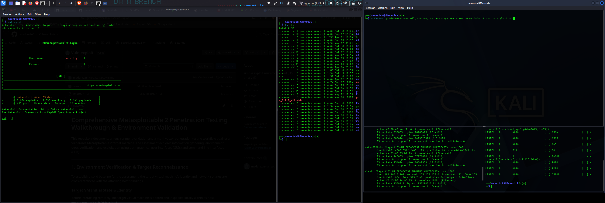
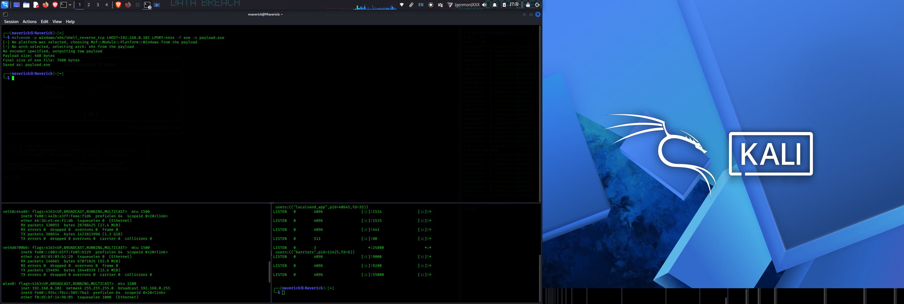
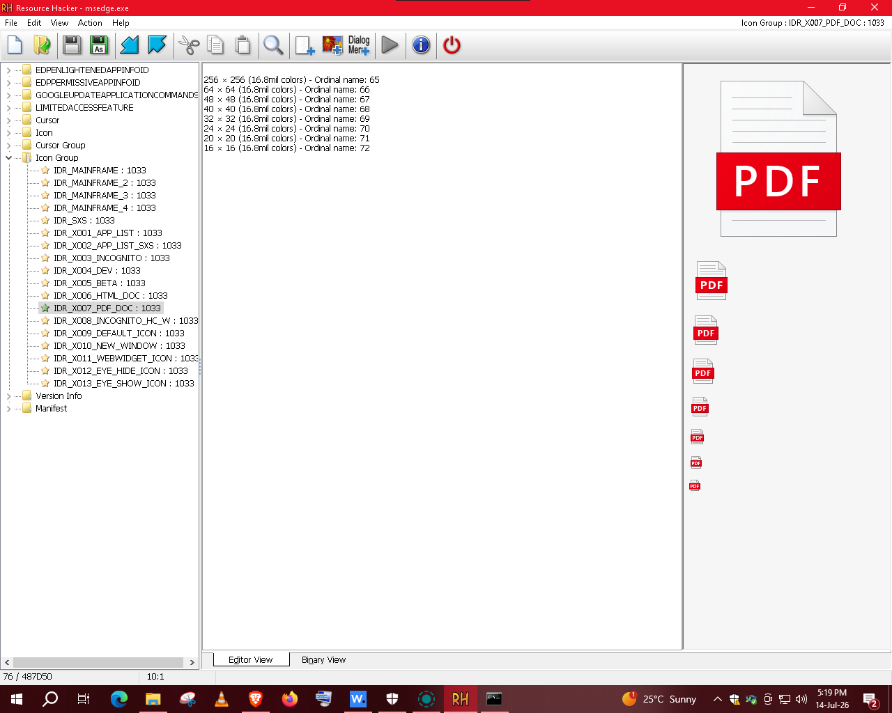
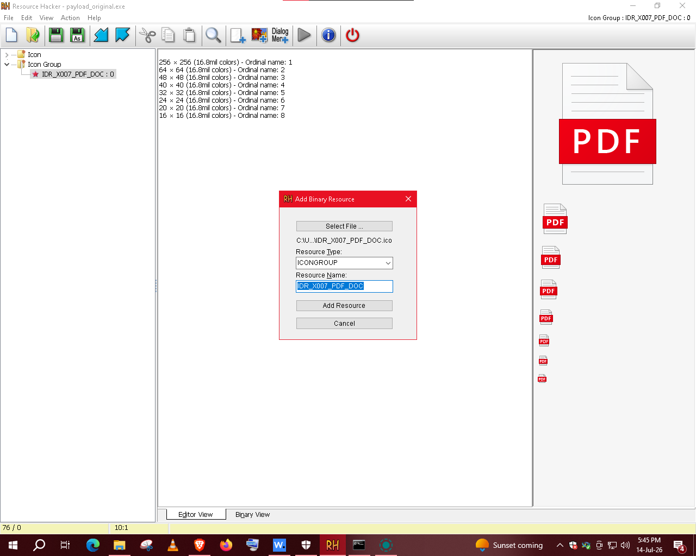
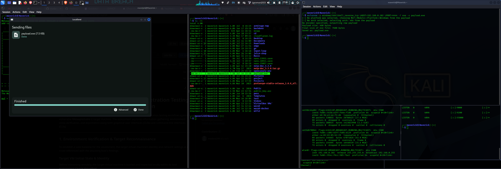
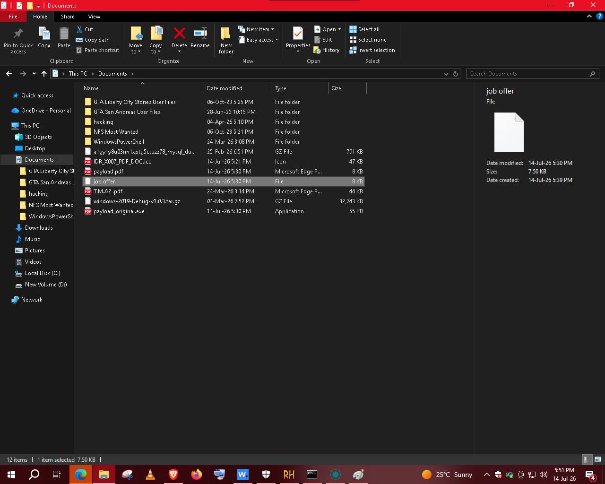
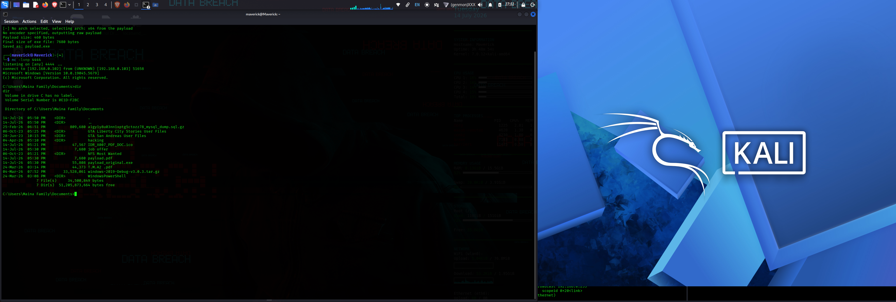

# Client-Side Simulation: Payload Auditing, Delivery, and Post-Exploitation Verification

This documentation covers the lifecycle of a simulated client-side assessment. It outlines payload configuration steps, binary icon customization to model real-world phishing vectors, network file transfer, and host identity correlation to verify the integrity of the established shell.

---

## 1. Payload Compilation Settings

The first phase establishes the configuration parameters for compiling a test binary designed to callback to the security analyst's platform.

### Step 1: Defining Handshake Parameters
Before compilation, interface properties are established to specify the callback destination.

* **Status:** Initializing the remote host parameter settings and callback ports prior to launching the compiler shell.

---

### Step 2: Binary Generation Success
The output binary is compiled and verified on the local host to ensure the execution engine is functional.

* **Status:** The compiler completes its run. The framework generates the raw execution file (`.exe`) and saves it locally in the workspace.

---

## 2. Resource Modification & Icon Spoofing

To simulate standard file-masking security awareness exercises, the default executable icon is replaced with a document icon.

### Step 3: Extracting Target Resources
Using **Resource Hacker**, the internal resources of the compiled binary are opened to replace the standard execution wrapper icon.

* **Status:** Opening the executable file in the editing software to choose and load an authentic Adobe PDF icon template.

---

### Step 4: Compiling Masked Binary Asset
The resource changes are saved, and the application compiles a modified file mapping the target icon index.

* **Status:** Verification of the finalized file state displaying the spoofed PDF icon layout in place of the default application graphic.

---

## 3. Host Delivery & Execution Context

The completed file is moved across the local testing segment from the Linux platform to the target Windows system.

### Step 5: Endpoint Retrieval
The file is pulled onto the Windows test environment to replicate a typical email-attachment download.

* **Status:** The simulated file `statement.exe` successfully lands on the target Windows system desktop.

---

## 4. Post-Exploitation Integrity Comparison

To confirm that the incoming connection corresponds to the target host system, directory paths and files are compared locally and remotely.

### Step 6: Local Windows Directory Validation
The files in the active directory on the Windows target are listed locally.

* **Status:** Establishing the baseline directory environment directly from the target machine's operating system interface.

---

### Step 7: Remote Shell Verification Match
A directory command is executed from the attacker's established console to prove direct system control.

* **Status:** Verification check comparing directory listings. The target system directories viewed remotely match the local folder files exactly, confirming successful session correlation.
