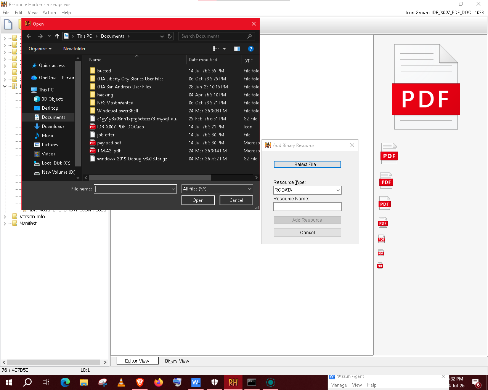
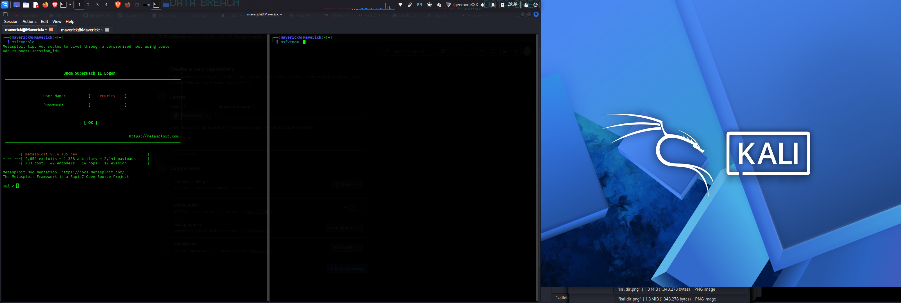

# Binary Resource Customization & Metasploit Payload Integration

This module documents the step-by-step process of preparing, modifying, and staging a custom client-side exploit. The workflow focuses exclusively on using the **Metasploit Framework** (`msfvenom` and `msfconsole`) to generate and manage the payload, combined with a resource editor to mask the file's visual footprint before delivery to the Windows host.

---

## 1. Payload Analysis & Compilation State
Before modifying any resources, the target binary must be compiled. The payload is generated as a standalone executable using **`msfvenom`**, which defines the reverse connection parameters, platform architecture, and output format.

> **Operational View:** Loading the raw `.exe` binary generated by `msfvenom` into the resource editor. The interface exposes the compiled structure of the Metasploit payload, indexing its system header details and default application icons, which are now staged for customization.

---

## 2. Icon Replacement & Embedding
To model realistic client-side delivery scenarios, the raw executable header is modified to replace its generic application graphic with a familiar document icon.

> **Operational View:** Replacing the default icon resource group with a spoofed Adobe PDF icon inside the editor. This ensures that when the payload is transferred to the Windows host, it visually mimics a standard document to the target user while keeping the underlying `msfvenom` exploit code completely intact.

---

## 3. Deployment Staging & Metasploit Listener Setup
With the icon embedded, the masked binary is staged for transfer. Command-line interactions are handled strictly inside **`msfconsole`** using the `exploit/multi/handler` module to await the remote system's callback.

> **Operational View:** Verifying the finalized payload file structure within the Linux terminal environment. The workspace displays the modified, deployment-ready executable alongside the listener configurations inside Metasploit, confirming the system is fully prepared to catch the incoming connection once executed on Windows.
